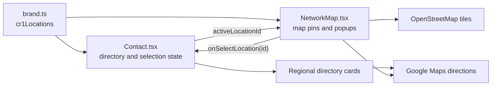

# CR-1 Philippines Network Locator

Developer documentation for maintaining the distributor and flagship-dealer locator.

## 1. Purpose

The network locator helps visitors:

- See every published CR-1 Philippines location in one map overview.
- Distinguish distributors from flagship dealers.
- Select a map pin or directory card to focus on one location.
- Open a location in Google Maps for directions.
- Return to the complete network view with **Show All Locations**.
- Browse locations grouped automatically by region.

This guide is written for developers who are new to the project. Read Sections 2–6 before editing the locator.

## 2. Quick start

### Requirements

- Node.js and npm.
- Internet access while using the locator because map tiles come from OpenStreetMap.

### Install and run

```bash
npm install
npm run dev
```

Open the local URL printed by Vite, then navigate to `/contact`.

### Production check

```bash
npm run build
```

There is currently no separate automated test command. Use the manual checklist in Section 10 after changing location data or map behavior.

## 3. Main files

| File | Responsibility |
| --- | --- |
| `src/app/data/brand.ts` | Source of truth for location names, roles, addresses, coordinates, and external links. |
| `src/app/components/Contact.tsx` | Owns the selected-location state and renders the locator heading, overview panel, regional directory, and inquiry form. |
| `src/app/components/NetworkMap.tsx` | Renders the interactive Leaflet map, markers, popups, and map viewport changes. |
| `src/styles/theme.css` | Contains CR-1 marker, popup, and Leaflet visual overrides. |
| `package.json` | Declares `leaflet`, `react-leaflet`, and Leaflet TypeScript definitions. |

Do not place branch data directly in `Contact.tsx` or `NetworkMap.tsx`. Add it to `cr1Locations` in `brand.ts`.

## 4. Architecture



### State flow

`Contact.tsx` stores:

```ts
const [activeLocationId, setActiveLocationId] = useState<string | null>(null);
```

The value has two meanings:

| Value | Result |
| --- | --- |
| `null` | Overview mode. The map fits all published locations inside the viewport. |
| A location ID | Focus mode. The map moves to that location and highlights its marker and directory card. |

The map receives the state and update callback:

```tsx
<NetworkMap
  locations={cr1Locations}
  activeLocationId={activeLocationId}
  onSelectLocation={setActiveLocationId}
/>
```

When a visitor clicks a marker, `NetworkMap` calls `onSelectLocation(location.id)`. When a visitor clicks **Show All Locations**, `Contact.tsx` sets the value back to `null`.

## 5. Location data model

Every location must match the `Cr1Location` type:

```ts
export type Cr1Location = {
  id: string;
  label: 'Distributor' | 'Flagship Dealer';
  name: string;
  address: string;
  city: string;
  region: string;
  latitude: number;
  longitude: number;
  mapUrl: string;
  mapEmbedUrl: string;
  websiteUrl?: string;
};
```

### Field reference

| Field | Required | Rules |
| --- | --- | --- |
| `id` | Yes | Unique, lowercase, and hyphenated. Never reuse an ID for a different branch. |
| `label` | Yes | Must currently be `Distributor` or `Flagship Dealer`. |
| `name` | Yes | Public-facing business or branch name. |
| `address` | Yes | Complete display address in English. |
| `city` | Yes | Used on the location card. Keep city spelling consistent. |
| `region` | Yes | Used to group directory cards automatically. Identical region text creates one group. |
| `latitude` | Yes | Numeric latitude, not a quoted string. |
| `longitude` | Yes | Numeric longitude, not a quoted string. |
| `mapUrl` | Yes | External Google Maps search or place URL used for directions. |
| `mapEmbedUrl` | Yes | Retained for compatibility with existing location consumers. The Leaflet overview does not currently use it. |
| `websiteUrl` | No | Official branch or dealer page. Omit it when no reliable page exists. |

## 6. Adding a distributor or dealer

### Step 1: Verify the business information

Confirm the following with an official business source or the CR-1 administrator:

- Official branch name.
- Network role.
- Complete current address.
- Correct latitude and longitude.
- Official website, if available.

Do not publish an unconfirmed branch. Do not copy a nearby landmark’s coordinates.

### Step 2: Add the location object

Open `src/app/data/brand.ts` and create a typed object:

```ts
const sampleDealerLocation: Cr1Location = {
  id: 'sample-dealer-quezon-city',
  label: 'Flagship Dealer',
  name: 'Sample Dealer',
  address: '123 Example Street, Quezon City, Metro Manila',
  city: 'Quezon City',
  region: 'Metro Manila',
  latitude: 14.676,
  longitude: 121.0437,
  mapUrl:
    'https://www.google.com/maps/search/?api=1&query=Sample%20Dealer%20Quezon%20City',
  mapEmbedUrl:
    'https://www.google.com/maps?q=Sample%20Dealer%20Quezon%20City&output=embed',
  websiteUrl: 'https://example.com/contact',
};
```

The values above are examples only. Replace every example value with verified branch information.

### Step 3: Add it to the exported list

```ts
export const cr1Locations: Cr1Location[] = [
  distributorLocation,
  flagshipDealerLocation,
  sampleDealerLocation,
];
```

The map, location counter, region counter, directory grouping, and marker list update automatically.

### Step 4: Check the marker

Run the website and confirm:

1. The new marker appears in the all-locations view.
2. The marker is located on the correct building or property.
3. Clicking it opens the correct popup.
4. The card appears under the expected region.
5. Clicking the card focuses the same marker.
6. **Google Maps** and **Get Directions** open the expected destination.

### Step 5: Build

```bash
npm run build
```

Do not consider the change complete if the build fails.

## 7. Map behavior

`NetworkMap.tsx` uses:

- `MapContainer` as the map root.
- `TileLayer` for OpenStreetMap tiles.
- `Marker` for each location.
- `Popup` for branch details and directions.
- `MapViewport` to switch between overview and focus modes.

### Overview mode

When `activeLocationId` is `null`, `MapViewport` creates bounds from every location and calls:

```ts
map.fitBounds(bounds, {
  maxZoom: 14,
  padding: [54, 54],
});
```

This is why all locations are visible initially. Do not replace the initial `null` state with the first array item unless the product requirement changes.

### Focus mode

When a location is active, the map calls:

```ts
map.flyTo([activeLocation.latitude, activeLocation.longitude], 16);
```

The animation duration becomes zero when the visitor has enabled reduced motion.

### Marker labels

- `D` means **Distributor**.
- `F` means **Flagship Dealer**.

If a new network role is introduced, update all of the following:

1. The `label` union in `Cr1Location`.
2. Marker-label logic in `NetworkMap.tsx`.
3. Any explanatory copy or legend shown to visitors.
4. This documentation.

## 8. Styling and responsive behavior

Map-specific styles begin with `.cr1-map-` in `src/styles/theme.css`.

Important classes:

| Class | Purpose |
| --- | --- |
| `.cr1-map-marker` | Removes Leaflet’s default marker-box appearance. |
| `.cr1-map-marker > span` | Creates the branded red CR-1 pin. |
| `.cr1-map-marker.is-active` | Gives the focused marker its dark active treatment. |
| `.cr1-map-popup` | Controls popup typography and spacing. |
| `.leaflet-container` | Sets the map canvas background and typography. |

The map container height is supplied by `Contact.tsx`:

```tsx
<div className="relative h-[26rem] sm:h-[32rem] lg:h-[36rem]">
```

Leaflet requires a parent with a real height. If the map becomes blank after a layout edit, check the parent height first.

The directory uses one column by default and two columns from the medium breakpoint. Map controls stack vertically on smaller screens so touch targets do not overlap.

## 9. Accessibility requirements

Keep these behaviors when editing the locator:

- Map markers must have meaningful `title` and `alt` text.
- Directory selectors must remain real `<button type="button">` elements.
- The selected directory button must expose `aria-pressed`.
- Decorative icons should use `aria-hidden="true"`.
- External links must retain visible focus styles.
- Interactive targets should remain at least approximately 44 pixels tall.
- Reduced-motion users must not receive the map fly animation.
- Location information must remain available in the HTML directory; do not make the map the only way to obtain it.

The HTML directory is especially important because interactive maps can be difficult for keyboard, screen-reader, and low-vision users.

## 10. Manual test checklist

### Desktop

- [ ] `/contact` starts in all-locations mode.
- [ ] Every published marker is visible without selecting a branch.
- [ ] Zoom controls work.
- [ ] Clicking a marker focuses it and opens its popup.
- [ ] Clicking a directory card focuses the matching marker.
- [ ] The active card and marker are visually distinct.
- [ ] **Show All Locations** restores the overview.
- [ ] Google Maps and dealer website links open correctly.

### Mobile

- [ ] The map is readable without horizontal page scrolling.
- [ ] Top location information does not cover the map controls.
- [ ] Bottom actions stack without overlapping.
- [ ] Directory cards fit within the viewport.
- [ ] Buttons and links are comfortable to tap.

### Keyboard and accessibility

- [ ] Tab focus is visible on cards, map controls, and links.
- [ ] Enter or Space selects a directory button.
- [ ] `aria-pressed` changes on the selected directory button.
- [ ] All branch information is readable without interacting with the map.
- [ ] Reduced-motion mode removes the map transition.

### Final technical checks

- [ ] `npm run build` succeeds.
- [ ] No duplicate location IDs exist.
- [ ] OpenStreetMap attribution is still visible.
- [ ] No API keys or private credentials were committed.

## 11. Troubleshooting

### The map area is blank

1. Confirm the device has internet access.
2. Check that the map’s parent still has a fixed or responsive height.
3. Check the browser console for tile-network or Content Security Policy errors.
4. Confirm `leaflet/dist/leaflet.css` is still imported in `NetworkMap.tsx`.

### A marker appears in the wrong place

The coordinates are incorrect. Verify `latitude` and `longitude` in `brand.ts`. Do not try to correct marker placement with CSS.

### A branch does not appear

Confirm the location object was added to the exported `cr1Locations` array. Defining the object alone is not enough.

### Locations appear under separate region headings

Region grouping uses exact text matching. For example, `Metro Manila` and `Metro manila` become different groups. Standardize the `region` values.

### Selecting a card does not focus the marker

Check that:

- The card calls `setActiveLocationId(location.id)`.
- The ID is unique.
- The same locations array is passed into `NetworkMap`.

### Marker styling disappeared

Check the `.cr1-map-marker` rules in `theme.css` and confirm `theme.css` is still imported through `src/styles/index.css`.

### TypeScript rejects a new role

The role is not part of the `Cr1Location['label']` union. Do not bypass it with `as any`; follow the role-update steps in Section 7.

## 12. Maintenance principles

- Treat `cr1Locations` as the single source of truth.
- Publish only verified locations.
- Keep external links environment-independent; never use localhost URLs.
- Preserve OpenStreetMap attribution.
- Keep map interaction optional by maintaining the directory.
- Prefer adding data over duplicating components.
- Run a production build after every locator change.

