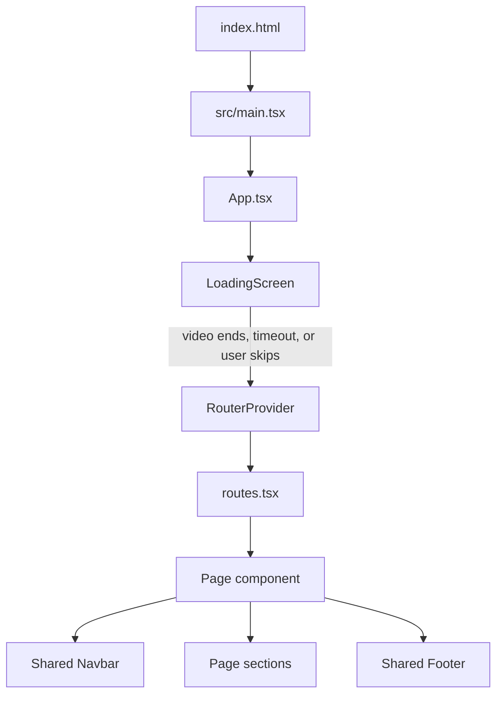

# CR-1 Philippines Website Developer Handbook

This handbook explains how to understand, run, maintain, test, and deploy the CR-1 Philippines / 7Power Motors website.

It is intended for developers who are new to the codebase. Read the Quick Start, Architecture, and Current Limitations sections before making changes.

## 1. Project summary

The website is a client-side React application for CR-1 Philippines. It includes:

- CR-1 product and coating information.
- Motorcycle and care-product catalogs.
- Service and application-process content.
- Searchable CR-1 pricing pages with Philippine-peso estimates.
- A distributor and flagship-dealer locator.
- Customer-service and business-partnership inquiry paths.
- A branded loading introduction.

The repository currently contains frontend code only. There is no application server, database, authentication system, or completed form-delivery integration.

## 2. Quick start

### Prerequisites

- Node.js 20 is recommended because CI and Docker use Node 20.
- npm.
- Git.
- Internet access for external map tiles, links, and embedded third-party content.

### Install dependencies

```bash
npm install
```

Use `npm ci` in CI or when installing exactly from `package-lock.json`.

### Start development

```bash
npm run dev
```

Vite prints the local development URL in the terminal. Open that URL in a modern browser.

### Create a production build

```bash
npm run build
```

The generated production files are written to `dist/`.

Important: never edit files inside `dist/` by hand. Change files in `src/`, then rebuild.

### Available npm commands

| Command | Purpose |
| --- | --- |
| `npm run dev` | Starts the Vite development server with hot reload. |
| `npm run build` | Compiles and bundles the production application. |

There are currently no dedicated `test`, `lint`, or `typecheck` scripts. The production build is the minimum required automated validation.

## 3. Technology stack

| Technology | Purpose |
| --- | --- |
| React 18 | Component rendering and local UI state. |
| TypeScript | Static types for components and data models. |
| React Router | Client-side routes, parameters, redirects, and query strings. |
| Vite | Development server and production bundling. |
| Tailwind CSS 4 | Utility classes and design-token integration. |
| Motion | Reveal animations and interaction transitions. |
| Lucide React | Interface icons. |
| Leaflet / React Leaflet | Interactive CR-1 network map. |
| Radix-based UI components | Accessible reusable UI primitives under `components/ui`. |
| Nginx | Production static hosting and single-page-app route fallback. |
| Docker | Reproducible production build and hosting container. |

The Vite alias `@` points to `src/`:

```ts
import { Navbar } from '@/app/components/Navbar';
```

Prefer the alias over long relative imports.

## 4. Application lifecycle



### Entry point

`src/main.tsx` mounts `App` into the `#root` element in `index.html` and imports the global CSS entry file.

### Loading introduction

`App.tsx` initially renders `LoadingScreen` instead of the router.

The loading screen finishes when:

- The video ends.
- The 5.2-second safety timer finishes.
- The visitor clicks **Enter Site**.
- The visitor presses Escape, Enter, or Space.

The skip button appears after 0.8 seconds. The `hasFinished` ref prevents `onFinished` from firing more than once.

Current behavior: the introduction runs after every full browser load because the completed state is not saved in session or local storage.

### Router

After the introduction, `RouterProvider` renders the matching route. `RouteScrollReset` scrolls to the top whenever the pathname or search string changes.

## 5. Repository structure

```text
7powermotors/
├─ .github/workflows/       GitHub Actions build and deploy workflow
├─ docs/                    Developer documentation
├─ src/
│  ├─ app/
│  │  ├─ components/        Reusable site sections and shared UI
│  │  │  ├─ ui/             Generic Radix-based UI primitives
│  │  │  └─ figma/          Image fallback helper
│  │  ├─ data/              Structured content and catalogs
│  │  ├─ lib/               Shared logic and animation presets
│  │  ├─ motorcycles/       Motorcycle listing and detail pages
│  │  ├─ pages/             Route-level page composition
│  │  ├─ App.tsx            Loading gate and router mount
│  │  └─ routes.tsx         Route definitions and redirects
│  ├─ styles/
│  │  ├─ images/            Image assets
│  │  ├─ videos/            Video assets
│  │  ├─ fonts.css          Font declarations
│  │  ├─ tailwind.css       Tailwind entry and supporting utilities
│  │  ├─ theme.css          Global tokens and shared component styles
│  │  ├─ pricing.css        Pricing-page-specific styles
│  │  └─ index.css          Global stylesheet import order
│  └─ main.tsx              Browser entry point
├─ Dockerfile               Multi-stage Node and Nginx image
├─ docker-compose.yml       Local/VPS container definition
├─ nginx.conf               SPA fallback and static caching
├─ package.json             Scripts and dependencies
├─ package-lock.json        Exact npm dependency versions
└─ vite.config.ts           Vite plugins, alias, and asset rules
```

## 6. Routes

Routes are defined in `src/app/routes.tsx`.

| URL | Page | Notes |
| --- | --- | --- |
| `/` | `Home.tsx` | Main CR-1 landing page. |
| `/motorcycles` | `MotorcyclesPage.tsx` | Searchable motorcycle catalog. |
| `/models` | `MotorcyclesPage.tsx` | Alias for the motorcycle catalog. |
| `/motorcycles/:id` | `BikeDetailsPage.tsx` | Motorcycle details by ID. |
| `/models/:id` | `BikeDetailsPage.tsx` | Alias for motorcycle details. |
| `/products` | `ProductsPage.tsx` | CR-1 care-product catalog. |
| `/services` | `ServicesPage.tsx` | Application process, services, models, and contact. |
| `/pricing` | `PricingPage.tsx` | Pricing category overview and search. |
| `/pricing/:slug` | `PricingDetailPage.tsx` | Detailed vehicle, helmet, or parts prices. |
| `/partners` | `PartnersPage.tsx` | Business-focused content and inquiry section. |
| `/contact` | `ContactPage.tsx` | Locator and inquiry form. |

### Contact intent query strings

The contact component reads the `intent` query parameter:

| URL | Effect |
| --- | --- |
| `/contact?intent=service` | Preselects the rider-service inquiry and customer-focused copy. |
| `/contact?intent=partner` | Preselects the dealership option and partnership-focused copy. |
| `/contact` | Shows the general inquiry version. |

Preserve these query strings when changing CTA destinations.

### Legacy pricing redirects

The application preserves older CR-1 pricing URLs:

- `/service` and `/service/index.html` redirect to `/pricing`.
- `/service/:legacyFile` maps known legacy HTML filenames to current pricing slugs.

When adding or renaming a pricing slug, review `legacyPricingSlugs` so existing inbound links keep working.

### 404 handling

Unknown routes render the catch-all 404 element. Route exceptions render `ErrorPage`.

Production hosting must fall back to `index.html` for unknown file paths. The included Nginx configuration already does this with `try_files`.

## 7. Page composition

Route-level files in `src/app/pages/` should mainly compose reusable sections.

Example:

```tsx
export default function ContactPage() {
  return (
    <div className="min-h-screen bg-background text-foreground">
      <Navbar />
      <main className="pt-20">
        <Contact />
      </main>
      <Footer />
      <ScrollToTop />
    </div>
  );
}
```

Common page-shell responsibilities:

- Render `Navbar` before the main content.
- Add top padding when the fixed navigation would overlap the first section.
- Render `Footer` after the main content.
- Include `ScrollToTop` for the floating back-to-top control.

### Homepage order

`Home.tsx` currently renders:

1. `Navbar`
2. `Hero`
3. `AboutCR1`
4. `ApplicationShowcase`
5. `ProductPreview`
6. `Footer`
7. `ScrollToTop`

Change the order in `Home.tsx`; do not duplicate a section just to move it.

## 8. Data ownership

Content that behaves like catalog data belongs in `src/app/data/`, not inside page markup.

| File | Source of truth for |
| --- | --- |
| `bikes.ts` | Motorcycle models, specifications, colors, prices, availability, and 360-view sources. |
| `products.ts` | CR-1 care products, categories, images, summaries, and use cases. |
| `pricing.ts` | Vehicle, helmet, and individual-parts source pricing. |
| `brand.ts` | Social links, contact details, distributors, flagship dealers, and map coordinates. |
| `applicationProcess.ts` | Application-process steps and official external links. |
| `sprayerImages.ts` | Sprayer gallery asset list. |
| `z900rsImages.ts` | Z900RS showcase asset lists. |

### Data change rule

If multiple components need the same information, centralize it in a typed data file. Avoid copying addresses, prices, URLs, or product names into several components.

### Adding a motorcycle

1. Add the image files under `src/styles/images/`.
2. Add a unique `Bike` object to `rawBikes` in `bikes.ts`.
3. Use an existing category value unless the filtering UI is also updated.
4. Verify the main image, every color image, and every 360 frame.
5. Open both the catalog and detail URL.
6. Run `npm run build`.

`bikes.ts` resolves image strings with `import.meta.glob`. Asset paths must match the real file path exactly.

### Adding a care product

1. Import its image in `products.ts`.
2. Add a unique `CareProduct` object.
3. Use a consistent category name because product filtering is text-based.
4. Verify the product listing and search behavior.

### Updating network locations

Use the dedicated [CR-1 Network Locator Guide](CR1_NETWORK_LOCATOR_GUIDE.md). It documents coordinates, map state, region grouping, accessibility, and testing.

## 9. Pricing system

The pricing feature is split into three responsibilities:

| File | Responsibility |
| --- | --- |
| `data/pricing.ts` | Raw structured pricing catalog and legal/service notes. |
| `lib/pricingLocalization.ts` | English translations and JPY-to-PHP display conversion. |
| `pages/PricingPage.tsx` and `PricingDetailPage.tsx` | Search, navigation, tables, mobile cards, breadcrumbs, and notices. |
| `styles/pricing.css` | Pricing layout and responsive presentation. |

### Exchange-rate maintenance

The conversion rate is intentionally explicit:

```ts
export const JPY_TO_PHP_RATE = 0.3803;
export const JPY_TO_PHP_RATE_DATE = '16 July 2026';
export const JPY_TO_PHP_RATE_SOURCE = 'Bangko Sentral ng Pilipinas';
```

Before changing the rate:

1. Verify a current authoritative source.
2. Update the numeric rate.
3. Update the displayed date.
4. Update the source label only if the source changed.
5. Check several known JPY values manually.
6. Confirm that pricing disclaimers still describe estimates accurately.

Never silently replace source prices. The PHP amount is an estimate derived from the underlying JPY value.

### Translation maintenance

`exactTranslations` maps known Japanese source strings to approved English text. `localizePricingText` also converts recognized yen amounts.

When untranslated text appears:

1. Copy the exact source string from `pricing.ts`.
2. Add a precise English entry to `exactTranslations`.
3. Preserve legal meaning, conditions, thresholds, and additional-charge language.
4. Search the rendered pricing page for Japanese characters and mojibake.
5. Test desktop tables and mobile cards.

Do not shorten legal notes merely to improve layout.

### Pricing performance

Pricing pages are lazy-loaded in `routes.tsx`, keeping their large catalog out of the initial route bundle. Preserve this lazy-loading behavior.

## 10. Contact and inquiry system

`Contact.tsx` combines:

- Intent-aware headings and helper text.
- CR-1 network map and directory.
- Phone, email, and social links.
- Customer and business inquiry fields.

### Important current limitation

The contact form does not send data to a server. Its submit handler prevents the browser submit and logs the object to the developer console:

```ts
const handleSubmit = (e: React.FormEvent) => {
  e.preventDefault();
  console.log('Form submitted:', formData);
};
```

Do not tell stakeholders that inquiries are delivered until a real endpoint, validation response, error state, and success state have been implemented and tested.

The footer newsletter form also has no delivery integration.

### Contact data check

Contact values are stored in `data/brand.ts`. Before production release, verify:

- `phoneLabel` is the desired public display text.
- `phoneHref` contains a complete dialable telephone number.
- The email inbox is monitored.
- Social links point to official accounts.
- Location addresses and coordinates remain current.

## 11. Network map

`Contact.tsx` lazy-loads `NetworkMap.tsx` so Leaflet is placed in a separate bundle.

Default state is `null`, which means all locations are visible. Selecting a pin or directory card sets a location ID and focuses the map. **Show All Locations** resets the ID to `null`.

OpenStreetMap provides the map tiles. Google Maps is used only for external directions links.

Do not remove the visible OpenStreetMap attribution. See the feature guide for full maintenance instructions.

## 12. Styling and theme system

Global CSS loads in this order from `src/styles/index.css`:

```css
@import './fonts.css';
@import './tailwind.css';
@import './theme.css';
@import './pricing.css';
```

### Current theme

The implemented interface uses a light CR-1 palette. `theme.css` is the source of truth.

Core tokens include:

```css
--background-primary: #ffffff;
--background-secondary: #f7f7f5;
--surface-color: #ffffff;
--text-primary: #1b1b1b;
--text-secondary: #626262;
--border-color: #e1e1de;
--brand-red: #e10600;
--accent: #d60000;
--accent-deep: #b80000;
--gold: #c8a96e;
--gold-strong: #86672f;
```

The `.dark` token block intentionally resolves to light surfaces as well. There is currently no user-facing dark-theme switch.

### Theme rules

- Use semantic tokens such as `bg-background`, `bg-card`, `text-foreground`, `text-muted-foreground`, `border-border`, and `text-accent`.
- Preserve CR-1 red and gold brand accents.
- Avoid adding new hardcoded near-duplicate reds.
- Use direct hex values only when the visual has a documented, component-specific reason.
- Check hover, focus, active, disabled, success, warning, and error states on light backgrounds.
- Maintain visible focus rings.

### Shared visual classes

`theme.css` defines reusable classes including:

- `.racing-section`
- `.racing-container`
- `.racing-title`
- `.racing-card`
- `.racing-button`
- `.racing-button-outline`
- `.brand-chip`
- `.form-field`
- `.motion-sheen`

Reuse these before creating another component-specific version.

### Pricing styles

Keep pricing-specific selectors in `pricing.css`. Do not move large pricing table rules into JSX class strings.

## 13. Motion and reduced motion

Shared reveal variants live in `lib/motionPresets.ts`:

- `revealContainer`
- `revealUp`
- `revealLeft`
- `revealRight`
- `mediaReveal`

Prefer these presets so transitions remain consistent.

CSS animations must include a `prefers-reduced-motion` fallback. JavaScript-driven motion should also check the media query when practical, as the network map does.

Animation should communicate hierarchy or state. Avoid animation that delays access to controls or makes content difficult to read.

## 14. Images, videos, and 360 assets

### Asset locations

- Images: `src/styles/images/`
- Videos: `src/styles/videos/`

Import assets through TypeScript whenever possible so Vite can fingerprint them:

```ts
import heroVideo from '@/styles/videos/cr1-hero-web.mp4';
```

### Image requirements

- Use descriptive filenames.
- Provide meaningful alt text for informative images.
- Use empty alt text only for truly decorative images.
- Compress large raster assets before committing them.
- Prefer WebP for suitable product imagery.
- Confirm transparent assets remain legible on the light theme.

### Video requirements

- Keep videos muted when autoplaying.
- Include `playsInline` for mobile browsers.
- Avoid relying on audio to communicate information.
- Provide a timeout or skip path for loading/intro video failures.
- Test on a throttled connection.

### Motorcycle 360 views

`Bike.view360` supports either:

- An array of local frame-image paths.
- A Sketchfab embed object with `{ type: 'sketchfab', src }`.

Do not mix the two formats in one value.

## 15. Navigation and links

- Use React Router `Link` or `NavLink` for internal routes.
- Use `<a>` for external websites, telephone links, email links, and same-page anchors.
- External links opened in a new tab must use `rel="noreferrer"` or the project-approved equivalent.
- Never hardcode localhost URLs in user-facing components.
- When adding a top-level route, update both desktop and mobile navigation where appropriate.
- Review footer links separately; navigation and footer link lists are not the same component.

## 16. Accessibility baseline

Every change must preserve:

- Semantic headings in a logical order.
- Native buttons for actions and links for navigation.
- Keyboard access to every interactive control.
- Visible focus indicators.
- Accessible names for icon-only controls.
- Form labels connected with `htmlFor` and `id`.
- Table headers using `scope`.
- Meaningful image alt text.
- Sufficient contrast on the light theme.
- Reduced-motion support.
- Touch targets around 44 pixels or larger.

Do not make information available only through hover, animation, color, or an interactive map.

## 17. Responsive design baseline

The project follows a mobile-first Tailwind approach.

Common breakpoints used by the site:

| Prefix | Minimum width | Typical use |
| --- | --- | --- |
| Base | 0 px | Phones and shared defaults. |
| `sm` | 640 px | Larger phones and compact tablets. |
| `md` | 768 px | Tablets and two-column content. |
| `lg` | 1024 px | Desktop navigation and wider grids. |

For every UI change, check at least:

- 360 px phone width.
- 768 px tablet width.
- 1280 px desktop width.

Avoid fixed widths that exceed the viewport. Large data tables must retain horizontal scrolling or mobile card alternatives.

## 18. Safe change workflows

### Add a new route

1. Create a route-level page in `src/app/pages/`.
2. Compose shared sections rather than copying their markup.
3. Register the route in `routes.tsx`.
4. Add navigation links only when the route belongs in global navigation.
5. Test direct navigation and browser refresh.
6. Test the 404 route.
7. Run the production build.

### Add a homepage section

1. Create a focused component in `components/`.
2. Use existing theme tokens and motion presets.
3. Import it into `Home.tsx`.
4. Place it in the correct content order.
5. Verify heading hierarchy and section spacing.

### Change global colors

1. Update semantic variables in `theme.css`.
2. Search for hardcoded versions of the old color.
3. Check cards, forms, tables, dialogs, navigation, and footer states.
4. Test contrast and focus states.
5. Do not automatically invert the interface.

### Change shared data

1. Find the owning file under `data/`.
2. Preserve the exported type.
3. Keep IDs stable unless a route migration is provided.
4. Search the ID or field name to find every consumer.
5. Validate every affected route.

## 19. Validation checklist

### Before opening a pull request

- [ ] `npm install` or `npm ci` succeeds.
- [ ] `npm run build` succeeds.
- [ ] The browser console contains no new errors.
- [ ] Changed routes work through in-app navigation.
- [ ] Changed routes work after a direct browser refresh.
- [ ] Desktop, tablet, and phone layouts were checked.
- [ ] Keyboard focus order and focus styling were checked.
- [ ] Reduced-motion behavior was checked when animation changed.
- [ ] External links open the intended destination.
- [ ] Legal notes and pricing conditions were preserved.
- [ ] No secrets, API keys, or private customer data were added.
- [ ] Generated `dist/` files were not edited manually.

### Data-specific checks

- [ ] IDs are unique.
- [ ] Prices and currencies are labeled correctly.
- [ ] Addresses and coordinates are verified.
- [ ] Image paths match filename case.
- [ ] Search filters find the new item.
- [ ] Empty-result states still work.

## 20. Deployment

Detailed deployment instructions are in the repository-level `DEPLOYMENT.md`.

### Docker build

The Dockerfile uses two stages:

1. Node 20 Alpine installs dependencies and runs the Vite build.
2. Nginx serves `dist/` as static files.

The container listens on port 80. `docker-compose.yml` maps host port 8080 to container port 80.

### Nginx behavior

`nginx.conf`:

- Falls back to `index.html` for client-side routes.
- Caches fingerprinted `/assets/` files for one year.
- Enables gzip for text assets.

### GitHub Actions

`.github/workflows/docker-deploy.yml` runs on pushes and pull requests to `main`:

1. `npm ci`
2. `npm run build`
3. Production artifact upload
4. Docker image build

VPS deployment is manual through `workflow_dispatch` and requires configured repository secrets. Do not change, expose, or print deployment secrets.

## 21. External services and dependencies

The frontend may contact:

- OpenStreetMap tile servers for the locator.
- Google Maps for directions links.
- Social media sites from brand links.
- Official CR-1 source pages from pricing and certificate links.
- Sketchfab for motorcycle models configured with an embed.

If a production Content Security Policy is added, these services must be reviewed explicitly.

Avoid adding a new third-party script when an existing dependency or native browser feature can solve the requirement.

## 22. Current limitations and technical debt

The next developer should know these before estimating work:

1. **Contact inquiries are not delivered.** The form only logs data to the console.
2. **Newsletter signup is not integrated.** The footer form has no backend action.
3. **Pricing exchange rate is manual.** It can become stale and must be reviewed with an authoritative source.
4. **No automated tests exist.** Regression testing is currently manual plus the production build.
5. **No lint script exists.** Code consistency depends on careful review and build validation.
6. **The intro runs on every full load.** Completion is not persisted per session.
7. **Contact telephone configuration needs verification.** The dial link must contain a complete number before production use.
8. **The application has no backend, database, authentication, or authorization layer.** Do not add business-sensitive behavior as client-only code.
9. **Some repository overview text may be historical.** For implemented behavior, trust the source code, `theme.css`, and this handbook.
10. **The main JavaScript bundle has a size advisory.** Preserve existing lazy loading and evaluate route-level splitting when adding large features.

## 23. Troubleshooting

### A route works through navigation but fails after refresh

The production server is not applying the SPA fallback. Confirm Nginx uses:

```nginx
try_files $uri $uri/ /index.html;
```

### An imported asset fails during build

- Confirm the path and filename case.
- Confirm the file exists under `src/`.
- Use a normal import for static component assets.
- For motorcycle data paths, confirm the extension is supported by the `import.meta.glob` pattern.

### Tailwind classes do not apply

- Confirm `src/styles/index.css` is imported by `main.tsx`.
- Confirm `tailwind.css` remains in the global import chain.
- Confirm the class name is statically discoverable rather than assembled from arbitrary strings.

### The locator is blank

See [CR-1 Network Locator Guide](CR1_NETWORK_LOCATOR_GUIDE.md#11-troubleshooting).

### Pricing still shows Japanese text

- Locate the exact source string in `pricing.ts`.
- Add it to `exactTranslations`.
- Confirm the file encoding is UTF-8.
- Check for mojibake, not only Japanese characters.

### The loading screen never closes

- Confirm the video import resolves.
- Confirm `onEnded={finishIntro}` is present.
- Confirm the safety timeout still calls `finishIntro`.
- Check for runtime errors before `LoadingScreen` mounts.

### Form submissions appear to do nothing

That is the current implementation. A real service endpoint and user-facing status states must be added before the form can deliver messages.

## 24. Handoff checklist for another developer

Before handing the project to someone else, provide:

- Repository access and the intended branch.
- Supported Node version.
- Current deployment environment and responsible owner.
- Approved brand assets and content sources.
- Current pricing-rate source and review date.
- Official contact, social, dealer, and distributor information.
- Required deployment secrets through a secure channel, never in Git.
- A list of unfinished integrations, especially forms.
- Links to this handbook and the locator guide.

The receiving developer should be able to install, build, navigate, and explain the application before beginning feature work.

